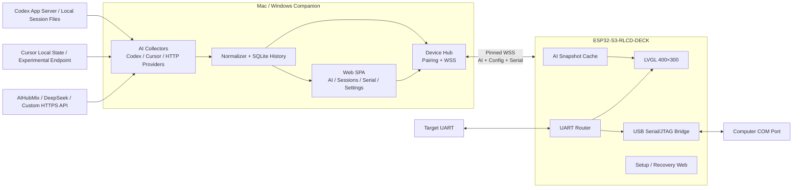
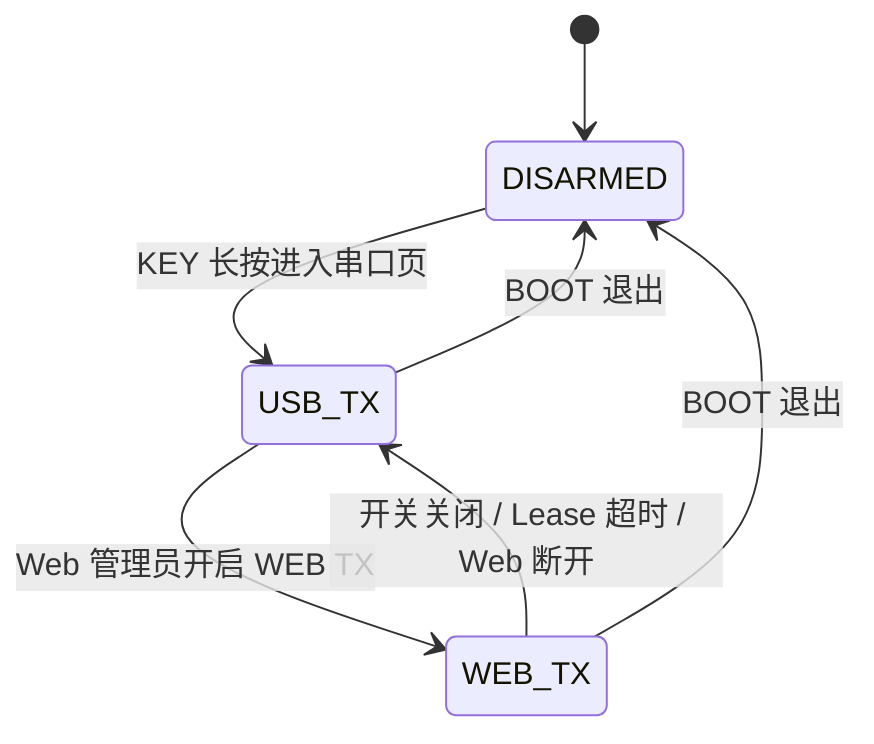

# S3 RLCD Deck 开发文档

> 版本：0.3（M0 实现完成后的 M1–M5 执行基线）
> 更新日期：2026-08-13
> 目标硬件：Waveshare ESP32-S3-RLCD-4.2 / ESP32-S3-RLCD-DECK  
> 固件基线：ESP-IDF 6.0.2、LVGL 9.4.x  
> Companion 基线：Go、macOS 13+、Windows 11 x64

当前状态：本文定义 V1 的产品范围、交互、接口、安全边界、实现路线和验收标准。M0 功能代码已经合并，剩余物理/长稳发布证据由 #1 跟踪；M1–M5 分别由 GitHub 父规格 #20–#24 及其实现票推进。

## 1. 产品目标

S3 RLCD Deck 是一台持续通过 USB 供电的双用途桌面终端：

1. **AI 用量终端**：默认显示 Codex 的额度窗口、Token 和当前会话状态；通过 KEY 循环查看 Cursor、AIHubMix、DeepSeek 及用户配置的其他 Provider。
2. **串口工具**：长按 KEY 后启用目标 UART，通过 USB 转发到电脑，并通过同一套 Web 控制台提供实时终端；开发板屏幕只显示串口状态和统计，不显示串口正文。

设备的显示与串口实时链路运行在 ESP32-S3。需要访问本机应用状态、账户凭据或外部 API 的工作统一放在 Mac/Windows Companion。完整 Web 控制台也由 Companion 提供；开发板只保留首次配网、配对和恢复所需的极简页面。

## 2. 核心设计决策

| 主题 | 决策 |
| --- | --- |
| 固件框架 | ESP-IDF 6.0.2；正式工程不以 Arduino 为基线 |
| 显示 | LVGL 9.4.x、本地渲染、黑白横屏 400×300 |
| 默认页面 | Codex 用量与最近活跃会话 |
| AI 采集 | 全部在 Companion；ESP32 不持有 Provider 凭据 |
| Codex 状态 | 额度使用官方 App Server；外部会话只做旁路推测并标记 `INFERRED` |
| Cursor | 个人用量为实验性适配器，失效时明确显示 `STALE/UNAVAILABLE` |
| Companion | Go 单文件后台程序、系统托盘/菜单栏入口、内置静态 Web SPA |
| Web | 完整页面运行在 Companion；ESP32 只提供 Setup/Recovery 页面 |
| 设备链路 | ESP32 主动连接 Companion，使用证书指纹固定的 WSS |
| 串口启用 | AI 页面保持 `DISARMED`；进入串口页才初始化 UART |
| 默认 TX | 每次进入串口页均为 `USB TX`；Web 可临时切换成 `WEB TX` |
| 串口屏幕 | 只显示参数、速率、计数、错误和连接状态 |
| 持久记录 | 不持久保存串口正文；ESP32 和 Companion 只使用内存环形缓冲 |
| 配对 | 最多保存 5 个 Companion；同时只有一个 Active Connection |
| 配置迁移 | 支持带密码的 `age` 加密备份，用户录入的 API Key 可包含在备份中 |
| 升级 | 用户确认的签名 OTA、A/B 分区、失败回滚；不做静默升级 |

## 3. 系统架构



### 3.1 两条运行链路

AI 链路允许短时离线：

```text
Provider / 本机工具
        ↓
Companion Collector → Normalizer → WSS Snapshot
                                      ↓
                              ESP32 Cache → LVGL
```

串口链路必须实时且隔离慢消费者：

```text
Target UART → UART RX → Router
                         ├─ USB sink
                         ├─ Companion WSS sink
                         ├─ ESP32 512 KiB ring
                         └─ Screen statistics
```

UI、Wi-Fi、Web 客户端或 USB 主机变慢时，只允许对应 sink 丢弃自己的最旧数据，不能反向阻塞 UART RX。

### 3.2 信任边界

- Codex/Cursor 登录状态、API Key 和自定义 Provider 密钥只存在 Companion。
- ESP32 只接收显式白名单字段构成的显示快照。
- 完整管理 Web 默认只在电脑回环地址开放。
- 设备入口与管理入口使用不同监听端口、Token 和权限。
- 串口正文不进入 AI 历史、诊断日志或设备持久存储。

## 4. 硬件基线

### 4.1 板卡资源

| 项目 | 基线 |
| --- | --- |
| 主控 | ESP32-S3-WROOM-1-N16R8，双核 LX7，最高 240 MHz |
| 内存 | 8 MB PSRAM |
| Flash | 16 MB |
| 显示 | 4.2 英寸反射式 RLCD，物理 300×400；项目使用横屏 400×300 |
| 网络 | 2.4 GHz Wi-Fi、BLE 5 LE；V1 只使用 Wi-Fi |
| 传感器 | SHTC3 温湿度传感器 |
| RTC | PCF85063ATL，外部 32.768 kHz 晶体 |
| 存储接口 | 板载 TF 接口不参与 V1 |
| 操作 | KEY、BOOT、PWR；无触摸 |
| 供电 | 设计假设设备始终通过 USB 或稳定外部电源供电 |

屏幕没有背光且只有黑白表达能力。状态必须通过文字、边框、填充纹理和图标共同表达，不能依赖颜色。

### 4.2 已使用引脚

微雪 LVGL V9 示例和板级资料中的主要引脚：

| 功能 | GPIO / 地址 |
| --- | --- |
| RLCD DC | GPIO5 |
| RLCD CS | GPIO40 |
| RLCD SCK | GPIO11 |
| RLCD MOSI | GPIO12 |
| RLCD RST | GPIO41 |
| RLCD TE | GPIO6 |
| I²C SDA | GPIO13 |
| I²C SCL | GPIO14 |
| SHTC3 | I²C `0x70` |
| PCF85063 | I²C `0x51`，RTC_INT 为 GPIO15 |
| KEY | GPIO18 |
| BOOT | GPIO0 |
| USB D- / D+ | GPIO19 / GPIO20 |
| 目标 UART RX | 扩展口 RXD / GPIO44 |
| 受控目标 UART TX | GPIO17 |

扩展排针当前映射：

```text
上排：VBUS  GND  GPIO19  GPIO20  TXD  RXD  SDA  SCL
下排：3V3   GND  GPIO0   GPIO1   GPIO2 GPIO3 GPIO17 GPIO18
```

丝印 `TXD/RXD` 是 UART0 信号，ESP32-S3 常用映射为 U0TXD/GPIO43、U0RXD/GPIO44。U0TXD 在复位阶段可能输出 ROM 启动日志，因此它不能满足“AI 页面绝不向目标设备发送”的严格要求。V1 使用 RXD/GPIO44 接收，使用空闲 GPIO17 作为应用控制的目标 TX；丝印 TXD 默认不连接目标设备。正式转接板投产前需要再次按实际板卡版本核对原理图和导通。

### 4.3 UART 接线

只接收：

```text
目标设备 TX  ─────>  RLCD-DECK RXD
目标设备 GND ─────>  RLCD-DECK GND
```

双向桥接：

```text
目标设备 TX  ─────>  RLCD-DECK RXD
目标设备 RX  <─────  RLCD-DECK GPIO17（受控 TX）
目标设备 GND ─────>  RLCD-DECK GND
```

电气规则：

- 不连接两块板的电源脚。
- 仅可直接连接 3.3 V TTL UART。
- 1.8 V 或 5 V UART 必须使用电平转换。
- RS-232/DB9 必须通过 MAX3232 一类收发器。
- 不需要向目标设备发送时，物理上只连接 RXD 和 GND。
- 不把丝印 TXD/U0TXD 连接到目标 RX；它可能包含芯片复位日志。
- 目标串口使用 `UART_NUM_1`，经 GPIO matrix 映射 RXD/GPIO44 和 GPIO17，避免复用 UART0 的应用日志通道。
- GPIO17 在启动和 AI 页面保持输入/高阻；只有进入串口页并安装 UART driver 后才配置为 TX。
- 退出串口页时卸载 driver，并立即把 GPIO17 恢复为输入/高阻。

## 5. 屏幕信息架构

### 5.1 全局状态栏

顶部固定显示：

- 本地时间。
- 经偏移校准的 SHTC3 温度。
- Wi-Fi 信号。
- Active Companion 在线状态。

湿度、设备 IP、固件版本和详细诊断放在 Web System 页面，不占用顶部空间。

### 5.2 Codex 默认首页

```text
20:36  +24.8C  WIFI 3/4  AGENT ON
----------------------------------------
CODEX  VERIFIED
PRIMARY [######----] R62% @2h30m
WEEKLY  [##--------] U22% 7d
TOKEN 146K
----------------------------------------
DECK DEVELOPMENT
RUNNING / INFERRED / 12m
18.4K TOK / CTX 41% / +2 SESS
TX DISARMED
```

显示优先级：

1. Codex 数据状态及可信度。
2. App Server 返回的动态额度窗口、剩余比例和重置时间。
3. 最近活跃会话的脱敏名称、状态、持续时间和本次 Token。
4. 其他活跃会话数量。
5. Credits 仅在官方接口实际返回时显示。

不把窗口名称或时长写死为固定产品规则；按接口返回动态渲染。
额度行用 `R` 表示剩余比例、`U` 表示已用比例、`@` 表示重置倒计时；倒计时超过
999 天时显示 `999d+`，避免异常远期时间破坏固定布局。

固件只把完整校验通过的快照投影为有界 Codex ViewModel；页面最多显示四个动态额度
窗口和一个按确定性优先级选择的脱敏会话。未知数值用 `--` 或整行隐藏，绝不渲染为
零。页面最多 13 行，ASCII 进度条、`VERIFIED`/`INFERRED`/`UNAVAILABLE` 与 `STALE`
文字状态不依赖灰度或颜色。名称按 UTF-8 字符边界和生成字体的最坏 glyph advance
截断，使每条动态行保持在 384 px 标签内；固定 400×300 黑白布局的
在线、离线不足 24 小时、离线达到 24 小时、无会话和 Provider 错误状态由 Host golden
snapshots 固定。Setup 页面始终拥有更高显示优先级；收到首个可读快照后，AI Page
成为默认页并保持 `TX DISARMED`。状态栏优先用可信 UTC 和快照中经验证的时区
换算本地时间；当时区不在固件的有界规则集内时，回退到已缓存 RTC，两者均不可用
则显示 `--:--`，不猜测偏移。

### 5.3 其他 Provider 页面

KEY 按用户配置顺序循环所有已启用 Provider：

```text
┌──────────────────────────────────────────────┐
│ 10:36  24.8°C   Wi-Fi ▮▮▮   AGENT ●          │
├──────────────────────────────────────────────┤
│ CURSOR                         EXPERIMENTAL   │
│ Balance       $18.42                          │
│ Usage         [███████░░░] 71%               │
│ Reset         2026-08-16                     │
│ Updated       10:35:42                       │
├──────────────────────────────────────────────┤
│ WEB 192.168.1.20:7777                        │
└──────────────────────────────────────────────┘
```

布局规则：

- 固定显示 Provider 名称、状态、更新时间。
- 优先显示余额和货币；存在额度周期时再显示百分比和重置时间。
- 只有 Token 或调用次数时，改为相应指标。
- 缺失字段隐藏，不用 `0` 冒充未知值。
- `STALE/UNAVAILABLE` 使用固定状态区域，避免布局跳动。
- 完整 Web 未开放局域网访问时显示 `WEB ON COMPUTER`；开放后显示可访问的 IPv4/mDNS 地址。
- Companion 离线时显示 `AGENT OFFLINE` 和开发板恢复页地址。

### 5.4 串口状态页

```text
┌──────────────────────────────────────────────┐
│ SERIAL          USB TX             00:18:32  │
├──────────────────────────────────────────────┤
│ 115200  8N1                                  │
│ RX  12,482,109 B     11.3 KiB/s              │
│ TX      18,420 B        0.2 KiB/s            │
│ UART ERR 0    ESP OVERWRITE 0                │
│ USB ●         AGENT ●       WEB CLIENTS 1    │
├──────────────────────────────────────────────┤
│ KEY: Stats    BOOT: Exit       Refresh 1s    │
└──────────────────────────────────────────────┘
```

屏幕不接收或保存用于显示的串口文本，只显示：

- `DISARMED / ARMED RX / USB TX / WEB TX`。
- 波特率、数据位、校验和停止位。
- 本会话 RX/TX 总量和实时速率。
- UART overflow、ESP 缓冲覆盖和 Companion 缓冲覆盖。
- USB、Companion、Web 客户端连接状态。
- 会话持续时间和刷新频率。

屏幕刷新档位为 0.5、1、2、5、10 秒，默认 1 秒；只影响屏幕统计，不影响底层数据流。

### 5.5 首次启动与离线状态

| 条件 | 屏幕行为 |
| --- | --- |
| 首次启动 | Setup 页面显示临时 AP、随机密码和恢复页地址 |
| Wi-Fi 已连接但未配对 | `PAIR COMPANION` |
| Companion 离线不足 24 小时 | 显示最后快照、时间戳和 `STALE` |
| Companion 离线超过 24 小时 | 隐藏额度数字，显示 `AGENT OFFLINE` 和恢复页地址 |
| 配对成功并收到快照 | 自动进入 Codex 首页 |

## 6. 按键与状态机

### 6.1 AI 页面

| 操作 | 行为 |
| --- | --- |
| KEY 短按 | `Codex → Provider 1 → Provider 2 → … → Codex` |
| KEY 长按 1.5 秒 | 进入串口页并初始化 UART |
| BOOT 短按 | 无操作 |
| BOOT 长按 3 秒 | 启动临时配置 AP |

即使没有其他 Provider，也保留一个配置提示页，用于显示 Web/恢复地址。

### 6.2 串口页面

| 操作 | 行为 |
| --- | --- |
| KEY 短按 | 切换串口统计子视图 |
| BOOT 短按 | 停止串口会话、撤销 TX、返回 Codex 首页 |

串口模式状态机：



规则：

- 进入串口页即 `ARMED`，默认 Owner 为 `USB TX`。
- Web 管理员可以在页面上切换到 `WEB TX`，无需设备再次确认。
- 切换到 `WEB TX` 时清空尚未发送的 USB TX 队列。
- `WEB TX` 期间电脑 USB 输入被拒绝并累计 `usb_tx_rejected`。
- 同时只允许一个已登录浏览器持有 Web TX Lease，默认 10 分钟并通过心跳续期。
- Web 页面关闭、心跳中断、Lease 超时或关闭开关时自动恢复 `USB TX`。
- 退出串口页时立即停止 UART、撤销 Owner、清空待发送队列。
- 下次进入串口页无条件从新的 `USB TX` 会话开始。

注意：按住 BOOT 的同时复位仍会进入芯片下载模式；运行时长按和复位期间按住不是同一行为。

## 7. AI 采集方案

详细的开源项目核验见 [AI 用量采集方案对比](research/ai-usage-collector-comparison.md)。

### 7.1 选型结论

没有单个项目同时满足跨平台、Codex/Cursor、精确外部会话状态、只读凭据和安全设备接口。V1 采用组合方案：

| 层 | 方案 |
| --- | --- |
| 跨平台采集主体 | 选择性复用 OpenUsage 的 Go Provider、平台检测和打包思路 |
| Codex 额度 | 官方 Codex App Server first |
| 外部 Codex 会话 | 参考 abtop，以进程和 JSONL 做只读旁路推测 |
| 历史聚合校验 | 参考 Tokscale |
| 配对和第三方余额契约 | 参考 Token Monitor |
| 兼容/UI 参考 | TokenTracker；不复用其 Codex 凭据刷新写回逻辑 |

所有复用代码必须固定到经过核验的提交、保留许可证声明并建立上游变更检查。不得把任何候选项目的宽泛原始响应直接发送给 ESP32。

### 7.2 Codex 官方数据与边界

Companion 使用 Codex App Server 的结构化能力：

- `account/rateLimits/read`：额度桶、使用比例、窗口和重置时间。
- `account/rateLimits/updated`：额度变化通知。
- `account/usage/read`：Token 活动和聚合统计。
- `thread/*`、`turn/*`：只对同一 App Server 实例拥有或加载的线程提供准确事件。

App Server 由版本化私有适配器以 `codex app-server --stdio` 启动。JSONL、初始化、请求
关联、通知和重连都封装在适配器内部；原始响应不得进入 Runtime、持久化或日志。额度通知
只触发重新读取额度与用量，不能单独覆盖当前快照。连接重建后必须清空此前的 thread
所有权；只有同一连接成功 `thread/resume` 的 thread 才能产生 Verified State。

V1 不接管用户的 Codex Desktop、IDE 或 CLI 会话，因此另启的 App Server 不能被描述为全局任务注册表。会话状态分级：

| source | confidence | 允许显示的状态 |
| --- | --- | --- |
| `codex_app_server_owned` | `verified` | Running、Waiting approval、Waiting input、Completed、Failed |
| `process_jsonl_observer` | `inferred` | Running、Recent、Ended、Unknown |
| `none` | `unavailable` | Unavailable |

强制规则：

- `waitingOnApproval` 只能来自官方事件或 active flags。
- 仅凭文件停止增长不能显示“等待审批”，只能显示 Recent/Unknown。
- Windows 上进程与会话文件无法唯一匹配时降级为 Unknown。
- 不上传 Prompt、回复、命令输出、工具参数或绝对路径。
- 会话标题默认隐藏；屏幕只显示用户别名或工程目录最后一级。

外部 Codex 会话观察器是独立的只读深模块：它不启动、恢复、附加、接管或向用户会话
发送信号。进程身份必须包含 PID 与启动时间；只有 macOS 上唯一进程与唯一文件的强映射，
并且同一身份下连续两次观察到文件增长，才允许输出 Running。首次观察、PID 复用、轮转、
重复 Session ID、多候选或 Windows 弱映射都不能继承 Running。文件停止增长只能变为
Recent/Unknown，失去 owner 且超过 recency 窗口后才变为 Ended。

扫描只读取一个完整且不超过 64 KiB 的 `session_meta` 首行，只提取上游 ID 做单向匿名化；
文件正文、文件名、绝对路径、进程名和所有原始 JSON 都不能越过观察器边界。目录遍历、候选
数量和保留窗口必须有界；macOS/Windows 必须从固定目录句柄相对 no-follow 打开后代，拒绝
symlink。平台进程枚举、辅助进程执行时间与输出同样必须有界，且不得把 Session 绝对路径放入
辅助进程 argv；权限错误、截断、轮转、partial JSON 或平台发现失败
只清空 inferred sessions 并重试，不能阻塞或覆盖官方 App Server 的额度、用量和 Verified
State。两源匿名 ID 相同时，Runtime 必须让 Verified State 胜出，总数仍受 16 项上限约束。

### 7.3 Cursor

个人 Cursor 用量没有公开稳定的官方 API。V1 适配器遵循：

- `experimental=true`。
- 只读访问本机 Cursor 数据和 access token。
- 不读取 refresh token，不主动刷新，不写回数据库或系统 Keychain。
- 私有 endpoint 和响应 schema 单独版本化并做严格校验。
- 失败只影响 Cursor 页面，不阻断其他 Provider、Web 或串口功能。
- 启用过的 Cursor 页面在失败时保留，显示旧值 `STALE` 或 `UNAVAILABLE`。
- 若未来出现个人官方 API，优先迁移。

### 7.4 AIHubMix、DeepSeek 与通用 Provider

Companion 提供内置模板，同时提供结构化 HTTP Provider：

- GET/POST。
- HTTPS URL。
- Headers 和 JSON Body。
- 余额、已用量、总额度、重置时间和货币的 JSONPath 映射。
- 1、5、15、30、60 分钟刷新档位。
- `Test Request` 脱敏预览。
- 从 curl 文本导入结构化字段。

边界：

- 不执行 curl、Shell、JavaScript 或任意插件代码。
- 远程 Provider 强制 HTTPS；HTTP 仅允许私有局域网地址并显示警告。
- 禁止重定向到不同主机。
- 默认超时 10 秒，响应体上限 256 KiB。
- 响应解析失败返回明确错误，不沿用错误字段。

### 7.5 统一 Provider DTO

```json
{
  "schema_version": {"major": 1, "minor": 0},
  "provider_id": "codex",
  "display_name": "Codex",
  "status": "ok",
  "source": "codex_app_server",
  "confidence": "verified",
  "experimental": false,
  "updated_at": "2026-08-09T10:36:05Z",
  "stale_after_seconds": 120,
  "balance": null,
  "windows": [
    {
      "name": "primary",
      "used_basis_points": 3800,
      "remaining_basis_points": 6200,
      "window_minutes": 300,
      "resets_at": "2026-08-09T13:20:00Z"
    }
  ],
  "tokens": {
    "input": 120000,
    "cached_input": 45000,
    "output": 18000,
    "reasoning": 8000,
    "total": 146000
  },
  "error": null
}
```

余额非空时使用 `{ "amount_micros": integer, "currency": "CNY" }`。百分比以
`0..10000` 基点整数表达，计数不超过 JSON safe integer `2^53-1`。未知值使用
`null`，不能使用零代替；两个百分比同时存在时合计必须为 10000。

未知 schema major 被拒绝并保留最后有效快照。更高 minor 只能增加 null、布尔或
有界整数字段；字符串、数组和对象必须经过新 major 的隐私审查。Provider 错误码固定为
`auth_stale`、`permission_denied`、`timeout`、`process_exited`、
`schema_changed`、`unavailable`。
每个带 `schema_version` 的对象最多包含 16 个 forward 字段，完整文档最多包含 2048
个 JSON syntax nodes；无独立版本的额度、Token、货币和错误子对象不接受扩展字段。

### 7.6 会话 DTO

```json
{
  "schema_version": {"major": 1, "minor": 0},
  "session_id": "anonymous-stable-id",
  "provider_id": "codex",
  "display_name": "s3-rlcd-deck",
  "state": "running",
  "source": "process_jsonl_observer",
  "confidence": "inferred",
  "started_at": "2026-08-09T10:24:00Z",
  "last_activity_at": "2026-08-09T10:36:01Z",
  "duration_seconds": 721,
  "turn_tokens": 18420,
  "context_used_basis_points": 4100
}
```

会话 `source/confidence/state` 必须来自 7.2 的组合。匿名 ID 只用于同一 Provider 内的
稳定关联；显示名是用户别名或工程目录最后一级。DTO 不得包含原始线程标题、Prompt、
回复、完整工程路径、文件名、命令、工具参数、凭据或上游 raw/attributes。

## 8. Companion 设计

### 8.1 交付形态

- Go 单文件后台程序。
- macOS 菜单栏和 Windows 托盘入口：打开控制台、显示连接状态、启动/停止、退出。
- 内置编译后的 Web SPA，不依赖公网 CDN。
- 开发阶段可前台运行；V1 提供 macOS LaunchAgent 和 Windows Task Scheduler 登录自启动。
- macOS 13+ 支持 Apple Silicon，保留 Intel 构建。
- Windows 11 x64 为正式目标，Windows 10 x64 best-effort。

V1 不引入 Electron。若未来需要独立原生窗口，可在同一 SPA 外增加轻量 WebView 外壳，不改变后端接口。

#### 8.1.1 安装、启动与升级事务

- `s3deck-companion --install` 是无管理员权限的当前用户安装入口。可执行文件按
  `version-commit` 写入私有 installation root；不覆盖或删除旧版本。
- macOS 使用带 installation-root 哈希后缀的 LaunchAgent；Windows 使用同样隔离的
  ONLOGON/LIMITED Task Scheduler 任务。`--enable-login`、`--disable-login`、
  `--installation-status` 与 `--uninstall` 共享同一状态机。
- 安装/升级在任何 schema 迁移之前为 Pairing trust、Device Hub identity、Provider 配置和
  Provider history SQLite/WAL/SHM 创建带逐文件 SHA-256 的私有快照。Installation Journal
  删除前的进程终止都按未提交处理；下次操作先恢复旧数据、旧可执行文件和旧启动注册。
- 安装事务持有 Maintenance Fence 与 Companion single-instance lock。安装期间被 LaunchAgent/
  Task Scheduler 拉起的新进程有界等待该 fence；普通重复启动仍立即失败。安装器不杀死未知
  进程，升级前必须退出正在运行的 Companion。
- 卸载结束登录启动并删除 Installation State，但保留用户数据、迁移快照和旧可执行文件，避免
  把“卸载应用”误当成“删除信任/凭据”。
- 安装默认 Device Hub 为 `127.0.0.1:7780`，管理 Web 仍为 `127.0.0.1:7777`。只有显式传入
  `--device-hub-address` 才允许 LAN 监听；安装器从不自动创建防火墙规则。
- 发布 ZIP 必须包含嵌入版本/commit、SPDX 2.3 SBOM、完整第三方许可证、逐文件 manifest、
  `SHA256SUMS` 和固定 `SOURCE_DATE_EPOCH` 的复现说明。平台签名/公证使用外部发布凭据，私钥
  不进入仓库、构建日志或未签名开发包。

### 8.2 推荐模块

```text
companion/
├── cmd/s3deck-companion/
├── internal/
│   ├── providers/
│   │   ├── codex/
│   │   ├── cursor/
│   │   └── httpbalance/
│   ├── sessions/          # App Server + passive observer
│   ├── normalize/         # Provider / session DTO
│   ├── history/           # SQLite, retention, CSV
│   ├── secretstore/       # opaque refs → Keychain / Credential Manager
│   ├── backup/            # age export/import
│   ├── devices/           # pairing, WSS, profiles
│   ├── serialhub/         # 8 MiB ring, browser fan-out
│   ├── web/               # management API + embedded SPA
│   ├── diagnostics/       # redaction + rotation
│   ├── installation/      # migration journal + login startup adapters
│   └── config/
└── web/
    ├── src/
    └── dist/              # go:embed
```

### 8.3 Web 与设备监听

| 入口 | 默认绑定 | 权限 |
| --- | --- | --- |
| 管理 Web | `127.0.0.1:7777` | 完整 UI、配置、历史、备份、串口控制 |
| Device Hub | 选定 LAN 地址/独立端口 | 配对后的 WSS、最小健康接口 |
| 可选 LAN Web | 用户显式开启 | 完整 UI，仍需管理员登录 |

要求：

- 管理和设备 Token 不复用。
- 管理写接口执行 Origin/CSRF 校验。
- Device Hub 设置请求大小、读取/写入超时、IP 限速。
- 未完成配对的设备不能获取快照或发送串口数据。
- 局域网管理未开启时，屏幕显示 `WEB ON COMPUTER`。

### 8.4 本地存储

Companion 使用本地 SQLite 保存最近 90 天的小时级用量、余额和额度快照：

- `Provider Hour` 是每个 Provider 在一个 UTC 小时内最后一次通过完整 DTO 校验的用量、
  余额、额度窗口和状态；同小时较旧的观察不能覆盖较新的观察。
- 只保存 Provider ID、UTC hour/observation、规范化状态/错误码、余额、Token 计数与额度窗口；
  不保存 display name、Session、Prompt、回复、raw response、凭据或串口正文。
- 默认保留 90×24 小时；恰好 90 天的边界小时保留。过期判断只使用当前 UTC，在启动、采集事务、
  设置切换和每小时维护中执行，因此禁用或空闲时也不会无限保留旧记录。
- 一个私有 worker 独占 SQLite 写连接和有界 capture queue；WAL 只读连接执行带时间与行数上限的
  查询。慢 CSV 客户端只能消费已经复制并关闭读事务的有界结果，不能持有 WAL snapshot、阻断采集
  或 Device Hub。
- 关闭记录与清空是写线程代际屏障；操作成功返回后，此前已开始但尚未入队的 capture 也不能越过
  屏障重新写入。查询拥有内部 deadline，不依赖调用方主动设置超时。
- 管理 Web 的鉴权接口支持查询、CSV 导出、持久关闭/开启记录和一键清空；写接口继续要求精确
  Origin 与 CSRF。
- 所有数据库时间为 UTC。DST 和用户时区只属于展示层，不改变 bucket 或 retention。
- 数据库使用 `user_version`；升级前先用 SQLite 一致性快照创建受保护备份，验证后才在一个事务内
  迁移。迁移失败回滚原库并保留备份；损坏或不可用只降级历史模块。
- Runtime 只公开固定的 `history_available`/`history_enabled` 布尔健康状态；写入失败、队列背压或
  关闭后，查询/导出返回 503，不把可能陈旧的数据伪装为正常，同时不影响采集与 Device Hub。

### 8.5 凭据

- macOS 使用 Keychain。
- Windows 使用 Credential Manager。
- 配置文件只保存 secret reference ID。
- Provider 配置替换/删除与待清理 reference 日志使用同一次受保护文件提交；Vault 清理失败在后续启动幂等重试。
- Access token 失效时返回 `AUTH_STALE`，提示用户回到原应用重新登录。
- Companion 不刷新、不轮换、不写回 Codex/Cursor 拥有的认证文件。

### 8.6 加密导出与导入

使用带密码的 `age` 加密备份，包含：

- 用户录入的 Provider 配置和 API Key。
- Provider 顺序、刷新频率和 Web 设置。
- Companion 应用设置。
- 设备资料和硬件配置缓存副本。

不包含：

- Codex/Cursor 自动发现的 OAuth、Cookie、access/refresh token。
- Companion 与设备之间的配对 Token。
- Web 登录会话。
- SQLite 历史数据库。
- 串口缓冲。

导入提供：

- 默认“合并”，冲突逐项确认。
- 明确警告后的“替换”。
- “仅导入 Provider”。
- 导入前脱敏预览。
- 错误密码、损坏文件或不支持的 schema 必须安全失败，不产生半导入状态。

实现约束：

- Backup Archive 是显式版本化 DTO，不复制任何 live store；`age` scrypt 二进制密文上限
  8 MiB，认证后的 JSON 明文上限 4 MiB，未知字段和未知 major 均拒绝。
- Preview 不返回 URL、header、request body、Secret Reference 或 secret value；它签发绑定
  archive digest、mode 和当前配置 digest 的 10 分钟单次 receipt。没有 Preview、receipt
  过期/重放或 Preview 后配置变化都不能 Import。
- Import 在 staging 内完成 schema、Provider、顺序、设置、设备资料、容量和逐项冲突决定验证；
  所有新 Secret Reference 先进入持久 cleanup journal，再写 Vault。只有一次受保护配置文件
  replacement 会激活完整结果并记录 retired references。
- commit 前失败会补偿全部 staged secrets；commit 后 Vault cleanup 失败保留 journal 并在启动时
  幂等重试。导入后的 listener/collector/settings graph 在 Companion 重启后一次生效。
- `POST /api/v1/backups/export` 返回 `application/vnd.age`；
  `POST /api/v1/backups/preview` 返回脱敏 Preview；`POST /api/v1/backups/import` 只接受该
  Preview receipt。三者都要求 management session、精确 Origin、CSRF 和敏感操作限流。
- 导出路径使用 owner-only `0600`（macOS）或 current-user-only DACL（Windows）的原子替换；
  导出 CLI 只从 owner-only passphrase file 读取密码，不把密码放入 argv/env，也不修改目标父目录
  的 mode/DACL。导入读取拒绝 symlink/reparse point、非普通文件、路径与 handle 身份变化及超限文件。

## 9. 多 Companion 与配对

### 9.1 配对流程

1. Deck 与 Companion 所在 Mac 保持连接同一个可互访的普通局域网；不切换到 Setup AP。
2. 未配对 Deck 首次联网自动打开有界 Pairing Window；已配对 Deck 由用户短按 BOOT 打开。
3. Deck 只在窗口内用 `_s3rlcd-pair._tcp.local.` 公告匿名、短期 Pairing Candidate。
4. 用户在认证后的 Companion Web 扫描并选择候选，Deck 生成并显示一次性六位码。
5. 用户把该码输入 Companion Web；双方通过 Security2 PAKE 建立认证加密通道，交换独立
   Device Token、Companion 证书、固定指纹和 Device Hub DNS-SD identity。
   macOS 的 Hub identity 必须通过所选物理局域网接口上的系统 Bonjour
   `DNSServiceRegister` 发布，并收到成功回调后才允许凭据离开 Mac；不得另开 UDP 5353
   listener 与 `mDNSResponder` 争用端口。
6. Deck Profile 与 Companion Trust 先暂存；只有新 Profile 建立证书固定、Token 认证的
   WSS hello/heartbeat 后才同时提交并显示成功。任何失败保留原 Profile 与 Active Companion。
7. 若断电启动后系统墙钟早于固件提交时间，Deck 只能用 PAKE 已认证或已提交的精确固定证书
   在其有效期内播种 TLS 临时时钟；已有可信墙钟不得为了未来或过期证书回拨。首个固定 WSS
   心跳随后提供可信 UTC。

浏览器只接触不透明候选/会话引用和用户当次输入的验证码。DNS-SD、日志、URL、诊断与持久
存储均不得出现验证码或凭据。Pairing v1 的 Setup 恢复页流程只在一个兼容版本内通过显式
`/compat/pairing-v1` 入口支持旧固件；不得回退成默认流程。完整决定见
[ADR 0026](adr/0026-bootstrap-companion-trust-with-lan-discovery-and-deck-displayed-pake.md)。
候选倒计时仅表示浏览器不透明引用的有效期，Companion Session 倒计时仅表示本地上限；
Deck 屏幕是 Pairing Window 和验证码截止时间的唯一权威。Web 不得把任一本地计时器标成
Deck 配对窗口剩余时间。

每个 Companion 使用独立 Token 和证书，可单独撤销。

### 9.2 多配对规则

- 每块开发板最多保存 5 个 Companion profile。
- Profile 包含名称、地址、设备 Token、证书指纹、优先级和最后成功时间。
- 同一时间只连接一个 Active Companion。
- Active Companion 离线超过 30 秒后，按优先级连接下一个。
- 切换成功后保持粘性；原高优先级设备恢复也不抢占。
- 用户可在恢复页手动选择 Active Companion，并事务修改每个 Profile 的整数优先级；数值越高越先尝试。
- Companion 之间不自动同步配置；使用加密备份手工迁移。

故障切换只在连续离线满 30 秒后开始一轮：按优先级降序、last-success 降序和稳定
Profile 顺序依次尝试其余候选；全部失败则回到原 Active，并重新等待完整窗口。候选首个
有效心跳与 Active/last-success 的事务提交同时成功后才完成切换。所有候选读取与提交都绑定
Profile generation，配对、地址更新、优先级修改、撤销或恢复页手动选择会使旧决定失效。
每条替代 WSS 在候选阶段只允许严格心跳；事务成为 Active 后才开放 Snapshot/Serial 数据面。
切换期间 Snapshot 保持 STALE，且只有新来源提交首个有效快照后才恢复；新的 WSS 连接必须等
独立的 Serial Web-transport epoch 撤销旧代排队请求并确认 Web TX 已回到 USB；它不得覆盖
BOOT exit/stop 使用的物理 lifecycle epoch。完整决定见
[ADR 0022](adr/0022-keep-companion-failover-sticky-and-generation-fenced.md)。

## 10. 设备协议

### 10.1 WSS 连接

ESP32 主动连接 Companion，便于处理设备 DHCP 地址变化和电脑防火墙规则。连接建立后先发送 `device.hello`：

```json
{
  "type": "device.hello",
  "protocol_version": 1,
  "device_id": "deck-01",
  "firmware_version": "0.1.0",
  "board": "esp32-s3-rlcd-4.2",
  "capabilities": ["display", "serial", "ota"],
  "serial_state": "disarmed",
  "serial_session_id": 0
}
```

Companion 验证 Token、证书连接、device ID 和协议版本后返回配置摘要与最新 AI 快照。

### 10.2 消息类型

控制消息使用带 `type` 和版本的 JSON：

| 消息 | 方向 | 用途 |
| --- | --- | --- |
| `device.hello` | ESP → Companion | 版本、能力、状态 |
| `device.heartbeat` | 双向 | 在线检测、时钟、队列水位 |
| `snapshot.ai` | Companion → ESP | 规范化 Provider 与会话快照 |
| `config.get/set/result` | 双向 | 权威配置读写和确认 |
| `serial.state` | ESP → Companion | 模式、Owner、统计、错误 |
| `serial.owner.request/result` | Companion ↔ ESP | USB/WEB Owner 切换 |
| `serial.history.request` | Companion → ESP | 网络重连后请求最近数据 |
| `ota.offer/chunk/result` | Companion ↔ ESP | 用户确认后的 OTA |
| `error` | 双向 | 结构化错误 |

串口原始流使用 WebSocket binary frame，至少带通道、序号、设备单调时钟和 payload length。原始字节不经过 UTF-8 转换。

V1 的精确 32-byte big-endian header 与 256-byte payload 上限由
`protocol/catalog/serial-frame-v1.json` 唯一定义。ESP 与 Companion 对同一 Session 的 sequence
和单调时间执行失败闭合校验；重连先以 `serial.history.request` 从 Companion 最新游标补发 Deck
history，再进入 live sink，避免重复或缺口被伪装为连续数据。

Companion Serial Hub 只在 RAM 保存当前 Session，payload 上限 8 MiB、frame metadata 上限
65,536、观察者上限 64。每个观察者拥有独立 ordinal cursor；覆盖只推进落后的观察者并累计其
丢失字节，不能阻塞 Device Link ingest。Session 结束、切换或 Companion 退出必须清零 payload、
关闭观察者并拒绝旧 Session 下载。下载单次最多 1 MiB，且不得写日志、SQLite、Backup Archive
或其他持久证据。

Web TX Lease 同时只能属于一个观察者，默认 10 分钟。Acquire、release、disconnect 与 timeout
均先进入 `transitioning`，只有 Deck owner 的 exact request result 才能发布最终状态；在 Deck
确认 USB 前 UI 不得提前显示 USB。Lease/browser/request capability 不得出现在普通管理状态 API。
Device Link 写失败属于送达结果不明，必须保留原 request 重试；Companion 重启后由 Deck 将外部
request ID 映射到 Link 生命周期内单调 ID。Runtime 停止时先有界关闭全部 observer，再撤权并等待
exact result，最后才能关闭 Device Link 和清空 Hub。
完整决定见 [ADR 0020](adr/0020-keep-serial-hub-history-volatile-and-lease-web-transmit.md)。

### 10.3 AI 快照

```json
{
  "type": "snapshot.ai",
  "protocol_version": 1,
  "schema_version": {"major": 1, "minor": 0},
  "generated_at": "2026-08-09T10:36:18Z",
  "timezone": "Asia/Shanghai",
  "provider_order": ["codex", "cursor", "deepseek"],
  "providers": [],
  "sessions": [],
  "next_refresh_seconds": 5
}
```

- Provider 间错误隔离。
- 完整快照不超过 16 KiB；Provider 最多 8 个，每个额度窗口最多 4 个，会话最多 16 个。
- `provider_order` 与 `providers` 的 ID 和顺序必须完全一致，会话必须引用本快照内的 Provider。
- ESP32 拒绝未知 major、缺失/重复字段、越界数值、无效关联与无效时间戳，并保留最后有效快照。
- 所有时间在线路上使用 canonical UTC RFC 3339（`Z`）；本地时区只用于显示。
- canonical schema、错误目录与两端共享 fixtures 位于 `protocol/`。

## 11. Web 控制台

### 11.1 侧边栏

| 页面 | 功能 |
| --- | --- |
| Overview | 设备、Codex/Cursor/其他 Provider 汇总 |
| AI Providers | Provider 配置、凭据、顺序、轮询、测试请求 |
| Codex Sessions | 会话列表、可信度、时间、匿名统计 |
| Serial Terminal | 实时终端、HEX、TX Owner、缓冲下载 |
| Network | Companion 地址、设备配对、Wi-Fi/连接状态 |
| System | 时间、温度、固件、OTA、诊断、备份、重启 |

SPA 静态资源构建后嵌入 Go 二进制，不引用公网字体、脚本或 CDN。

AI Providers 页面通过受认证的 `/api/v1/providers`、`/api/v1/providers/order` 与
`/api/v1/providers/{id}/test` 管理模板和自定义 Structured HTTP Provider。写操作必须满足
精确 Origin、CSRF 与敏感请求限流；浏览器只得到 `secret_configured`，不能得到 Secret
Reference。配置先完成 Vault/受保护文件事务，再由单一动态 supervisor 协调 collector；
每次状态变化由 Runtime 生成完整 `snapshot.ai`，Device Hub 对每台 Deck 只合并最新快照。

### 11.2 串口终端开源组件

- 使用 `xterm.js` 作为文本/ANSI、Unicode、滚动、搜索和终端渲染核心。
- 复用 `pineTERM` 的 MIT 许可 HEX 显示、HEX 输入、日志导出和预设命令设计。
- 把原项目的 Web Serial transport 替换为 Companion WebSocket transport。
- 自研范围只包括传输适配、设备协议、TX Owner 和产品 UI 集成；不自行实现 ANSI 终端模拟器。

查看方式：

- Text/ANSI。
- HEX。
- Text + HEX。

发送方式：

- 文本及 CR/LF 选项。
- HEX 字节。
- 用户保存的预设命令。

浏览器层负责显示转换，Companion 和 ESP32 始终保留原始字节。
用户主动创建的 Serial Preset 是受保护的应用配置，不是串口历史：最多 32 项、单次发送仍不超过
256 bytes、不会从 RX/TX 自动生成，也不能绕过 Web TX Lease。预设可进入 `age` 加密备份，但不进入
日志、诊断、历史、AI Snapshot、浏览器持久存储或 ESP32。

### 11.3 多浏览器

- 允许多个已登录浏览器同时只读观察。
- 同时只有一个浏览器持有 WEB TX Lease。
- Lease 默认 10 分钟，心跳续期。
- 浏览器关闭或失联时释放 Lease，ESP32 自动恢复 USB TX。

## 12. 串口实现

### 12.1 参数

| 参数 | 支持 |
| --- | --- |
| 波特率 | 1200～921600，常用预设 + 自定义 |
| 数据位 | 7、8 |
| 校验 | None、Even、Odd |
| 停止位 | 1、2 |
| 默认 | 115200 8N1 |
| 硬件流控 | 不支持 |
| RX / TX 引脚 | GPIO44 / GPIO17 |

V1 正式保证 115200。更高速率只有通过相同压力测试后才在 Web 中标记 `VERIFIED`。

### 12.2 Router 与背压

```text
UART driver event queue
        ↓
serial_rx → fixed blocks → serial_router
                              ├─ usb_ring       16～64 KiB
                              ├─ wss_ring       16～64 KiB
                              ├─ history_ring   512 KiB PSRAM
                              └─ stats events   latest-only
```

- 不让多个消费者竞争弹出同一个队列。
- Router 为每个 sink 管理独立 ring 和 drop counter。
- Sink 满时丢该 sink 最旧块，不能等待。
- UART FIFO overflow/driver buffer full 是全局严重错误，必须置顶显示。
- 屏幕事件只保留最新统计。
- 固定块池避免逐字节动态分配。

### 12.3 双层历史缓冲

| 位置 | 大小 | 生命周期 | 用途 |
| --- | --- | --- | --- |
| ESP32 PSRAM | 默认 512 KiB，可配置 64～2048 KiB | 当前串口会话 | Companion 短暂断线恢复 |
| Companion RAM | 8 MiB | 当前串口会话 | 浏览器重连、搜索、多观察者、下载 |

覆盖最旧数据时累计 `overwritten_bytes`。串口会话结束或 Companion 退出时清空。Web 下载只包含当前会话。

### 12.4 USB

V1 使用 ESP32-S3 USB Serial/JTAG 的单 CDC 通道作为目标串口桥：

- 发布固件的目标串口流不与 ESP-IDF console 日志混用；发布配置关闭 ESP-IDF console。
- 发布固件诊断走 Web/内存诊断环。开发/HIL 构建可临时启用结构化 USB `boot_ok` 与无凭据的 `deck_build_identity`，仅用于启动和构建身份验收，并在发布配置中关闭。
- 目标 UART 不使用 U0TXD；USB console/ROM 输出不会通过 GPIO17 注入目标设备。
- USB sink 独立任务处理，不能从 UART RX 同步写 USB。
- USB source 同样使用独立任务读取原始字节；只有 owner task 可把固定队列中的字节写入 UART1。
- 读取 USB 前即记录当时的 Owner generation；提交 UART 前必须再次完全匹配，跨越 `USB → WEB → USB` 的读取同样拒绝。
- `WEB TX` 期间读到的字节只累计 rejected，不会在 Lease 回退后补发。
- UART1 TX 使用无软件 TX ring 的非阻塞 FIFO 部分写；Owner 切换清除所有尚未交给硬件的 source block。
- USB Serial/JTAG 驱动使用固定 4 KiB RX/TX ring；电脑未打开或占用端口时只允许 USB sink 自身背压、覆盖最旧块。
- USB 断开不结束 Serial Session；已复制的单个部分写 block 可在重连后继续，退出会清零并释放。
- 不烧不可逆 USB eFuse。
- 设备复位产生的 ROM USB 启动文字不作为 V1 问题处理；正常工作时先启动设备，再进入串口页。
- 关闭可能让 USB 断开的睡眠模式。

发布版若未来需要双 CDC 或从枚举开始完全隔离启动文字，再单独评估 TinyUSB；不在 V1 同时维护两套 USB 方案。
开发/HIL 配置占用同一个 CDC 发送结构化诊断，因此显式禁用目标桥；USB bridge 的实机验收必须使用关闭 diagnostic console 的 release artifact。

## 13. 固件架构

### 13.1 组件

```text
firmware/
├── main/
├── components/
│   ├── board_support/       # 引脚、RLCD、按键、RTC、SHTC3
│   ├── display/             # 1bpp framebuffer、异步 panel 提交
│   ├── application_ui/      # 唯一 LVGL owner、ViewModel 与页面
│   ├── companion_link/      # pairing、WSS、协议、failover
│   ├── snapshot_store/      # 校验、缓存、stale 规则
│   ├── serial_service/      # UART、Router、统计、Owner
│   ├── usb_bridge/          # USB Serial/JTAG sink/source
│   ├── setup_web/           # 最小配网和恢复页面
│   ├── settings/            # NVS、版本和迁移
│   ├── ota_service/         # 签名、A/B、回滚
│   └── health/              # 看门狗、堆、队列和诊断
└── sdkconfig.defaults
```

### 13.2 任务与所有权

| 任务 | 职责 | 关键约束 |
| --- | --- | --- |
| `ui` | 唯一 LVGL owner | 其他任务只能发送 ViewModel/事件 |
| `companion_link` | WSS、心跳、快照、配置、重连 | Provider 错误不能重启链路 |
| `serial_rx` | UART driver queue → blocks | 串口会话中的最高业务优先级 |
| `serial_router` | USB/WSS/history/stats 扇出 | 不等待慢 sink |
| `usb_sink/source` | 电脑 COM 双向数据 | Owner 不是 USB 时拒绝电脑输入 |
| `wss_serial_sink/source` | Companion 双向原始流 | Owner 不是 WEB 时拒绝 Web TX |
| `setup_web` | AP 和恢复页 | 仅恢复模式运行 |
| `health` | 看门狗、内存、队列水位 | 生成脱敏诊断 |

AI 页面下不创建活跃 UART 数据路径；进入串口页后再安装/启动 UART driver 和相关任务，退出时释放。

### 13.3 配置所有权

| 配置 | 权威端 |
| --- | --- |
| Provider、API Key、顺序、轮询 | Companion |
| Codex 隐私、历史、Web 用户 | Companion |
| Wi-Fi、Companion profiles | ESP32 |
| UART 参数、缓冲大小、屏幕刷新 | ESP32 |
| 温度偏移 | ESP32，Companion Web 写入并等待确认 |
| 时区 | Companion 权威，ESP32 缓存 |

Web 修改 ESP32 配置时使用 write-through：只有收到设备确认才显示成功。Companion 的缓存副本不在重连时擅自覆盖设备。

### 13.4 快照持久化

- Snapshot Store 在内存中立即保存最后一个校验通过的规范化 AI Snapshot。
- `snapshot_nvs` 是独立 128 KiB 分区；candidate 和两个交替 blob 都带存储版本、
  长度与 CRC，读回校验成功后才原子切换 active marker。
- 首次快照立即 checkpoint；后续成功或失败的 Flash 尝试最多每 30 分钟一次。
  独立 worker 执行 NVS 打开、恢复读取、写入和关闭，Store 创建先返回有界内存态；带版本
  与 CRC 的 attempt watermark 让失败节流在重启后仍然成立。已有事务但 watermark 缺失或
  损坏时，从首次可信 UTC 起保守等待 30 分钟；窗口到期后从最后有效事务记录重建并允许
  瞬态故障恢复。Flash 节流、慢打开/读取/写入或 NVS 故障都不阻塞新的有效内存快照和 UI
  读取；异步恢复与已发布 live 快照按时间戳合并，较新者保留，同时间戳但字节冲突时
  fail-closed 到已提交记录。关闭时在 2 秒预算内排空已排队
  checkpoint；驱动仍阻塞时保留完整 owner 并允许幂等重试关闭。
- Companion Link 只通过统一 message dispatch 把完整校验通过的 `snapshot.ai`
  发布给 Snapshot Store；解析失败、过大、隐私边界、未来时间、时间回退或未知 major
  都不能覆盖最后有效快照。
- Companion 离线不足 24 小时时 Snapshot Store 允许读取旧文档并标 `STALE`；达到
  24 小时、时钟无效或任一可信时间源低于其 high-water mark 时不向 UI 暴露文档/额度，
  只返回 Unavailable State；时间恢复到原 high-water 后才重新可见。

### 13.5 时间与温度

- 协议和数据库统一保存 UTC。
- 显示时按 Companion 配置时区转换，默认 `Asia/Shanghai`。
- ESP32 联网后使用 SNTP 校时，并写入 PCF85063 RTC。
- RTC 未校准时显示 `--:--`，不使用编译时间或硬编码时间。
- SHTC3 温度偏移可配置，初始值采用微雪示例的 `-4°C`，装壳后重新校准。
- 完全断电后的 RTC 保持依赖板卡 J7 外接备份电源，V1 不作持续走时承诺。

### 13.6 Setup AP

- BOOT 长按 3 秒或首次启动时开启。
- 每次生成随机热点密码并显示在屏幕上。
- 10 分钟无操作自动关闭，配置成功立即关闭。
- 恢复页只允许 Wi-Fi、Active Companion/Profile 恢复和基础硬件设置；正式首次配对使用
  同一普通 LAN 的 Pairing v2。Pairing v1 只保留显式兼容入口。
- 恢复页不能查看 Provider API Key。

### 13.7 OTA

- Companion Web 检查/选择固件，用户明确确认后上传。
- ESP32 使用 A/B OTA 分区和 boot rollback。
- 固件校验数字签名、完整性和板卡型号。
- 首次启动新固件完成健康检查后才标记有效。
- OTA 中断、签名失败或健康检查失败时保留/回滚旧固件。
- BOOT/UART 烧录始终作为恢复路径。

## 14. 安全与隐私

### 14.1 强制规则

- ESP32 永不接收 Provider API Key、Codex/Cursor Cookie 或 OAuth token。
- Companion 不改写 Codex/Cursor 认证文件或 Keychain 项目。
- 设备 WSS 使用每个 Companion 独立的 Token 和固定证书指纹。
- Token 使用常量时间比较，可轮换、可逐设备撤销。
- 管理写操作要求登录、CSRF/Origin 校验和合理速率限制。
- 会话输出只使用匿名 ID、脱敏名称和统计。
- 不发送匿名遥测、崩溃报告或使用统计到外部服务。

### 14.2 诊断日志

Companion 保存脱敏轮转日志，默认保留 7 天或最多 50 MiB：

- 禁止记录 Authorization、Cookie、API Key。
- 禁止记录 Prompt、回复、工具参数和串口正文。
- 本地路径只保留必要的最后一级或哈希。
- Provider 响应只记录状态码、耗时、schema 版本和脱敏错误。
- 支持导出脱敏诊断包。

ESP32 发布固件只维护小型内存诊断环，通过已登录的 System 页面读取。开发/HIL 构建允许启用不含凭据或用户数据的结构化 USB 启动事件。

生产实现把诊断定义为封闭数据模型，而不是自由文本：Companion 的 `internal/diagnostics`
只接受固定 level/module/code、有限数字、schema 版本、脱敏 error code 和短 SHA-256 标识；
没有能表达异常正文、URL、Header、路径、Provider raw、Prompt、工具参数或 Serial 正文的字段。
单一后台 worker 非阻塞接收事件；owner-only JSONL 活动段以原子替换持久化，并按 1 小时或
256 KiB 封存为 immutable 分段；队列或存储压力只增加 bounded dropped 计数。System 的
`GET /api/v1/diagnostics` 读取状态，受登录、
Origin、CSRF 和敏感操作限流保护的 `POST /api/v1/diagnostics/export` 在内存中生成固定路径 ZIP，
包含最近 24 小时事件、最多 32 个 Deck 环、配置 schema key，以及逐文件 size/SHA-256 manifest；
不创建导出临时文件，也不自动上传。

Deck 的 `health` 组件维护 64 项 enum+numeric 内存环。只有已激活且声明 `diagnostics` capability
的 Device Link 才响应精确 request ID；Companion 严格校验共享 `diagnostics.request` /
`diagnostics.snapshot` 契约后缓存。参见
[`ADR 0024`](adr/0024-bound-diagnostics-to-fixed-redacted-events.md)。

## 15. 开发环境

### 15.1 当前基线

- ESP-IDF：`/Users/xiaowang/.espressif/v6.0.2/esp-idf`
- 已验证版本：ESP-IDF v6.0.2
- LVGL：锁定 9.4.x
- 芯片目标：ESP32-S3
- 当前观察到的设备口：`/dev/cu.usbmodem1101`，实际名称可能变化
- VS Code 使用 Espressif ESP-IDF 扩展，烧录方式为 UART

```bash
source /Users/xiaowang/.espressif/v6.0.2/esp-idf/export.sh
idf.py --version
idf.py set-target esp32s3
idf.py build
idf.py -p /dev/cu.usbmodem1101 flash monitor
```

注意：

- 不使用普通 CMake Tools 配置 ESP-IDF；建议 `cmake.configureOnOpen=false`。
- ESP-IDF 管理 Ninja；缺少 `build.ninja` 通常意味着配置失败。
- 烧录/监视前关闭其他串口工具。
- 当前已验证的是 UART 烧录路径，不把 JTAG 作为默认设置。

### 15.2 微雪 LVGL V9 示例兼容补丁

本机使用 ESP-IDF 6.0.2 构建微雪 `02_Example/ESP-IDF/09_LVGL_V9_Test` 时，依赖解析和 LVGL 9.4.0 可以进行，但显示驱动的 GPIO 类型需要修正：

```cpp
io_config.dc_gpio_num = dc_;
io_config.cs_gpio_num = cs_;
```

应把 `DisplayPort` 的 GPIO 参数和成员统一改为 `gpio_num_t`：

```cpp
DisplayPort(
    gpio_num_t mosi,
    gpio_num_t scl,
    gpio_num_t dc,
    gpio_num_t cs,
    gpio_num_t rst,
    int width,
    int height,
    spi_host_device_t spihost = SPI3_HOST);
```

临时最小转换：

```cpp
io_config.dc_gpio_num = static_cast<gpio_num_t>(dc_);
io_config.cs_gpio_num = static_cast<gpio_num_t>(cs_);
```

正式工程采用类型正确的成员定义，不通过降低编译严格性掩盖问题。

## 16. 推荐仓库结构

```text
s3-rlcd-deck/
├── firmware/
│   ├── main/
│   ├── components/
│   ├── partitions.csv
│   └── sdkconfig.defaults
├── companion/
│   ├── cmd/
│   ├── internal/
│   ├── web/
│   └── go.mod
├── protocol/
│   ├── schema/
│   └── fixtures/
├── hardware/
│   └── uart-adapter/
├── tests/
│   ├── integration/
│   └── hardware-in-loop/
└── docs/
    ├── DEVELOPMENT.md
    └── research/
```

协议 fixtures 同时供 Go 和 ESP-IDF 测试使用，防止两端各自演化出不兼容字段。

## 17. 实施里程碑

### M0：板级与 UI 基线

- ESP-IDF/LVGL 工程。
- 修正微雪 RLCD 驱动兼容问题。
- 400×300 黑白基准页、中文字体和刷新验证。
- KEY/BOOT、SHTC3、PCF85063。
- Setup/Recovery 页面。

完成标准：连续显示 24 小时，无异常重启；按键短按/长按可靠；时间无效状态正确。

### M1：Companion 与配对

跟踪规格：[#20](https://github.com/Vectorking-50kg/s3-rlcd-deck/issues/20)

- Go 程序骨架、托盘/菜单栏、嵌入 SPA。
- 管理入口与 Device Hub 分离。
- Pairing v2 同 LAN 匿名发现、Deck 显示一次性码、Security2 PAKE、证书指纹固定与 WSS 心跳。
- 多 Profile 数据结构先落地，故障切换可在 M5 完成。
- Pairing v2 实板验收时 Mac 与 Deck 始终保留在同一普通 LAN，不需要 Linux helper、管理员
  网络切换或 Setup AP。用户必须从 Deck 屏幕读取验证码并经正式 Web 流程完成；Host seam 不得替代。
- Pairing v1 的双网口 Linux Setup-client 验收仅用于一个兼容版本的旧固件路径，在
  Pairing v2 实板证据通过前保持独立 BLOCKED，不得设置 Pairing v2 的通过状态。
- Pairing v1 兼容验收中，任何会修改 Companion Profile 的 Pairing 前，控制端必须先通过
  独立事务取得并保存
  原 Profile 快照；SSH 返回或客户端网络清理失败不能丢失补偿依据。
- Pairing v1 兼容验收的 Linux 客户端在切换 Wi-Fi 前只持久化非秘密 UUID 补偿日志；控制端每次事务后必须用
  新 SSH 连接执行幂等 cleanup/verify，并以跨进程事务锁等待旧 primary 完全退出。SSH
  cleanup 还必须留下 cancellation fence，使尚未取得锁的迟到 primary 永久拒绝变更。
  控制口必须由 NetworkManager 明确识别为 Ethernet。每次请求都重新绑定受验 helper
  SHA-256。

### M2：Codex 首页

跟踪规格：[#21](https://github.com/Vectorking-50kg/s3-rlcd-deck/issues/21)

- 官方 App Server 额度和 Token。
- abtop 风格只读会话观察。
- VERIFIED/INFERRED/UNAVAILABLE 契约。
- Codex 默认首页、动态额度窗口和离线快照。

### M3：其他 Provider

跟踪规格：[#22](https://github.com/Vectorking-50kg/s3-rlcd-deck/issues/22)

- Cursor 实验适配器。
- AIHubMix、DeepSeek 模板和通用 HTTP Provider。
- SQLite 90 天历史。
- OS 凭据存储和 `age` 加密备份。
- Provider 循环页面。

### M4：串口工具

跟踪规格：[#23](https://github.com/Vectorking-50kg/s3-rlcd-deck/issues/23)

- `DISARMED → USB TX ↔ WEB TX` 状态机。
- 受控 GPIO17 TX、UART Router、512 KiB PSRAM ring、USB bridge。
- Companion 8 MiB ring 和多浏览器观察。
- xterm.js + pineTERM 功能集成。
- 115200 长稳压力测试。

### M5：产品化

跟踪规格：[#24](https://github.com/Vectorking-50kg/s3-rlcd-deck/issues/24)

- 最多 5 个 Companion、优先级和粘性故障切换。
- 签名 OTA、A/B 回滚。
- 诊断包、可恢复 Installation Transaction、登录自启动和升级迁移。
- macOS/Windows 72 小时验收。

### 17.6 签名 A/B OTA

- Firmware Bundle 采用 ECDSA P-256 / SHA-256，版本化公钥目录是跨端唯一权威；私钥不进入仓库、Companion、日志或产物。
- Manifest 固定绑定 key ID、最低 Device Link 协议、镜像长度、`esp32-s3-rlcd-4.2`、版本和镜像 SHA-256。
- Companion Preview 只做完整校验并生成内存单次 receipt；Apply 必须经 Web 明确确认，且全局只允许一个 OTA Transaction。
- Device Link 每次只发送一个 3072-byte chunk，并等待同 transaction ID 的精确 `ota.result`；10 分钟总时限、30 秒 Deck 空闲时限、错误或断连均立即终止。
- Deck 只流式写下一个 OTA app slot；只有签名、顺序、摘要、ESP image 和内嵌版本全部一致才选择该 slot。
- V1 downgrade policy 只接受 semantic core 严格大于当前固件的版本；同版本、预发布变体和降级均拒绝。
- 首启保持 pending verify；UI/display、peripheral service、Wi-Fi 与 Active Companion Link 在 60 秒内健康才标有效，否则自动回滚。
- 不写 bootloader、partition table、NVS 或 eFuse，不启用不可逆 Secure Boot；BOOT 与 release USB Serial/JTAG 始终独立可恢复。
- Host 覆盖 wrong board/signature/length/hash/offset、interruption/timeout、Flash failure、Boot Health 决策、公钥目录一致性和签名工具；实板仍需逐断点故障注入。

## 18. 测试与验收

### 18.1 自动化测试

- Provider DTO：缺字段、null、未知枚举、未知小版本、过大响应。
- Codex：官方额度与推测状态不能混淆。
- Cursor：私有 schema 变化时隔离失败并返回 unavailable。
- curl 导入只解析白名单字段，不能执行命令。
- JSONPath 映射、货币、时间和异常数值。
- WSS 配对、证书不匹配、Token 撤销、协议版本不兼容。
- 配置 write-through 和设备拒绝路径。
- `age` 正确密码、错误密码、损坏文件、合并冲突和事务回滚。
- NVS 双快照断电恢复和 CRC 错误。
- UART Router 各 sink 的独立背压和计数。
- USB/WEB Owner 切换、Lease 超时和退出清理。

### 18.2 硬件在环

- 115200 8N1 连续 72 小时，校验发送/接收/丢弃总量。
- 同时执行 Wi-Fi 重连、WSS 重连、页面切换、USB 插拔和 Web 客户端堵塞。
- 电脑不开 COM、COM 被占用、USB 断开再连接。
- Companion 休眠/重启、DHCP 地址变化和 Active Companion 故障切换。
- 进入串口页前确实无应用层 UART 桥；退出后立即停止。
- WEB TX 期间 USB 输入不进入目标 UART；回退后 USB 恢复。
- 测试 230400/460800/921600；只有通过同等级测试才标记 verified。
- Setup AP 密码、超时和恢复流程。
- OTA 下载中断、供电中断、签名错误和新固件健康检查失败。

### 18.3 跨平台验收

- macOS 13+ Apple Silicon 连续运行 72 小时。
- Windows 11 x64 连续运行 72 小时。
- 登录自启动、睡眠唤醒、网络切换和防火墙提示。
- Codex/Cursor 路径发现与无权限状态。
- 从 Mac 导出加密备份，在 Windows 导入 Provider 与 API Key。
- Windows 重新登录 Codex/Cursor并建立独立设备配对。

### 18.4 V1 发布门槛

- Codex/Cursor/自定义 Provider 单独失败不影响其他模块。
- 所有数值带时间戳；旧数据明确 stale，未知值不显示为零。
- 外部 Codex 会话不被标成 verified。
- 屏幕无串口正文；Web/USB 原始流不被 UI 转码破坏。
- 115200 长稳测试无 UART 主链路丢包；硬件溢出必须准确报警。
- API Key、Cookie、Prompt 和串口正文不出现在日志、AI 快照或 ESP32 持久存储。
- OTA 失败可回滚，BOOT/UART 可恢复。

## 19. 主要风险

| 风险 | 应对 |
| --- | --- |
| Cursor 个人接口变化 | 实验适配器、schema 校验、错误隔离、保留 unavailable 页 |
| 外部 Codex 会话无法精确观察 | 显式 INFERRED，状态集合受限，不显示假审批状态 |
| OpenUsage 等上游快速变化 | 固定提交、保留许可证、适配层测试、定期人工升级 |
| Go Companion 与 ESP 协议漂移 | 共享 schema/fixtures、major version gate |
| Windows 路径和权限差异 | 真实 Windows 11 验收，不只做单元测试 |
| WSS 本地证书轮换 | 每个 Profile 固定指纹，显式重新配对，不静默信任新证书 |
| 串口慢消费者 | 独立 sink ring、丢最旧、独立计数、UART RX 不阻塞 |
| USB/Web 同时发送 | 单 TX Owner、切换清队列、USB rejected counter |
| U0TXD 复位日志注入目标 | 目标 TX 改用 GPIO17；丝印 TXD 不连接目标 RX |
| Flash 磨损或快照损坏 | 30 分钟写入上限、双 blob、CRC、原子 active marker |
| 固件升级失败 | 签名、A/B、健康确认、回滚和 UART 恢复 |

## 20. 参考资料

### 板卡与固件

- [微雪 ESP32-S3-RLCD-4.2 文档](https://docs.waveshare.net/ESP32-S3-RLCD-4.2)
- [微雪 ESP32-S3-RLCD-4.2 GitHub](https://github.com/waveshareteam/ESP32-S3-RLCD-4.2)
- [ESP-IDF 6.0.2 ESP32-S3 Get Started](https://docs.espressif.com/projects/esp-idf/en/v6.0.2/esp32s3/get-started/index.html)
- [ESP-IDF USB Serial/JTAG](https://docs.espressif.com/projects/esp-idf/en/v6.0.2/esp32s3/api-guides/usb-serial-jtag-console.html)
- [ESP-IDF USB Device/TinyUSB](https://docs.espressif.com/projects/esp-idf/en/v6.0.2/esp32s3/api-reference/peripherals/usb_device.html)
- [LVGL 9.4](https://docs.lvgl.io/9.4/)

### Codex、Cursor 与采集参考

- [Codex App Server 官方文档](https://learn.chatgpt.com/docs/app-server)
- [Codex Pricing and Usage](https://learn.chatgpt.com/docs/pricing)
- [Cursor API 文档](https://cursor.com/docs/api)
- [OpenUsage](https://github.com/janekbaraniewski/openusage)
- [abtop](https://github.com/graykode/abtop)
- [Token Monitor](https://github.com/Javis603/token-monitor)
- [Tokscale](https://github.com/junhoyeo/tokscale)
- [TokenTracker](https://github.com/xiufengsun/TokenTracker)
- [本项目 AI 采集方案对比](research/ai-usage-collector-comparison.md)

### Web 串口

- [xterm.js](https://github.com/xtermjs/xterm.js)
- [pineTERM](https://github.com/WeSpeakEnglish/pineTERM)
- [GoogleChromeLabs Serial Terminal](https://github.com/GoogleChromeLabs/serial-terminal)

## 21. 下一步

M0 功能代码合并后立即搭建 M1 的 Go Companion、配对和 WSS 骨架；先用固定模拟快照打通 Codex 首页，再接入真实采集器。M1 实现可与 M0 剩余物理/长稳证据并行，但 V1 发布仍要求 M0 验收报告最终通过。这样可以尽早验证跨端协议和恢复路径，避免业务适配器掩盖基础问题。
